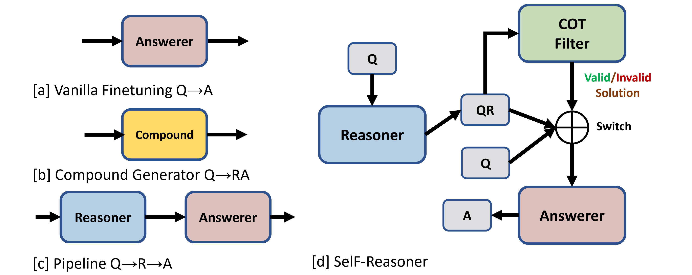

# Mitigating Misleading Chain-of-Thought Reasoning with Selective Filtering

<a href="https://arxiv.org/abs/2403.19167">[📃 Paper]</a> &emsp; <a href="https://librowu.github.io/publication/coling24/">[🌐 Website]</a> 

## Abstract

Large language models have manifested remarkable capabilities by leveraging chain-of-thought (CoT) reasoning techniques to solve intricate questions through step-by-step reasoning chains. Despite its success, the efficacy of such reasoning is inherently contingent upon the quality of CoT. However, flawless CoT reasoning cannot be guaranteed due to the presence of indecomposable questions and the potential for erroneous reasoning chains, particularly in the case of small-scale language models. To tackle this challenge, we propose a novel approach called the selective filtering reasoner (SelF-Reasoner) that assesses the entailment relationship between the question and the candidate reasoning chain. Then, we proceed with CoT reasoning when the reasoning chain demonstrates confidence; otherwise, we opt to predict the answer directly. SelF-Reasoner improves the fine-tuned T5 baseline consistently over the ScienceQA, ECQA, and LastLetter tasks. Code is available at https://github.com/LibroWu/SelF-Reasoner.

